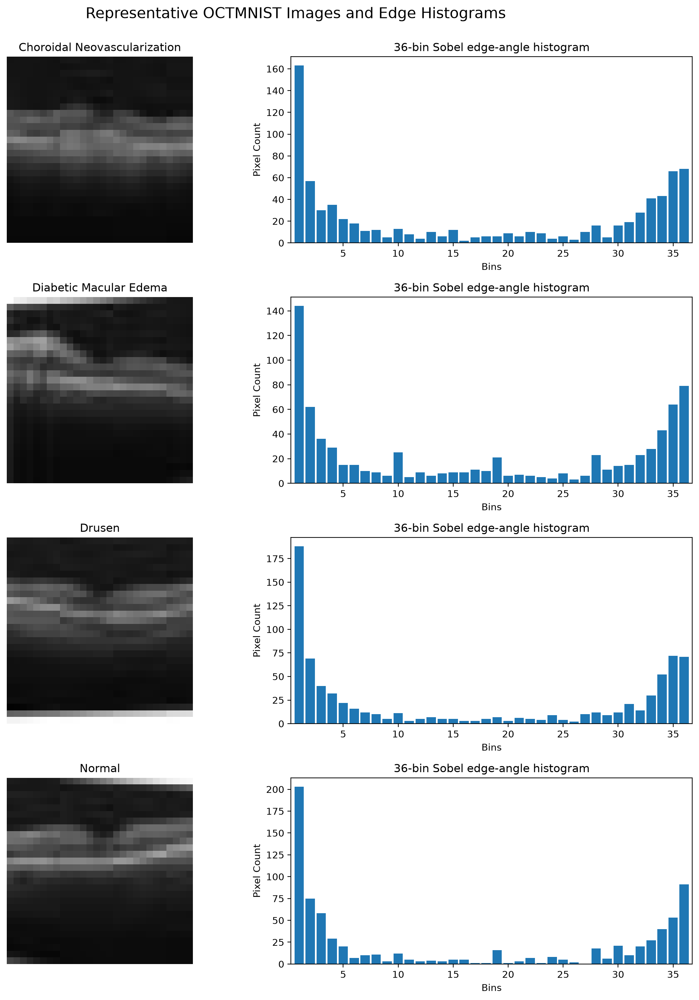
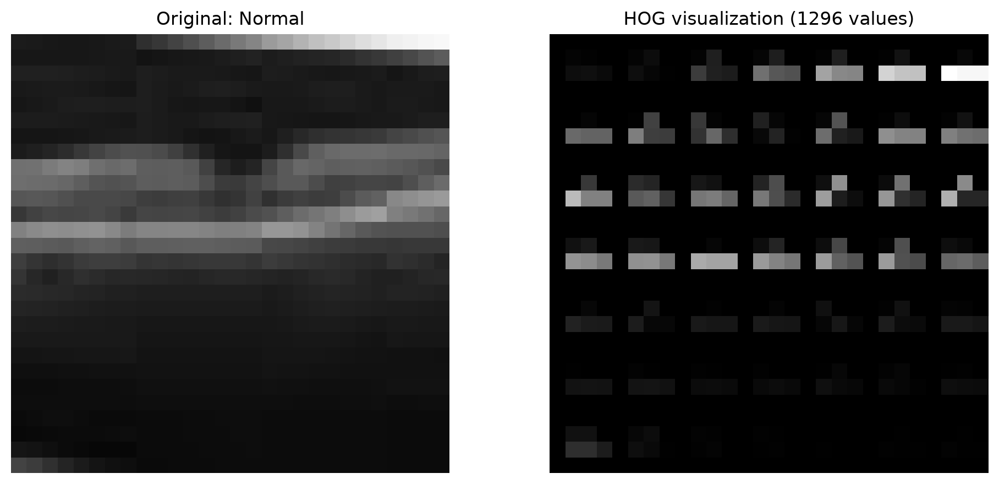
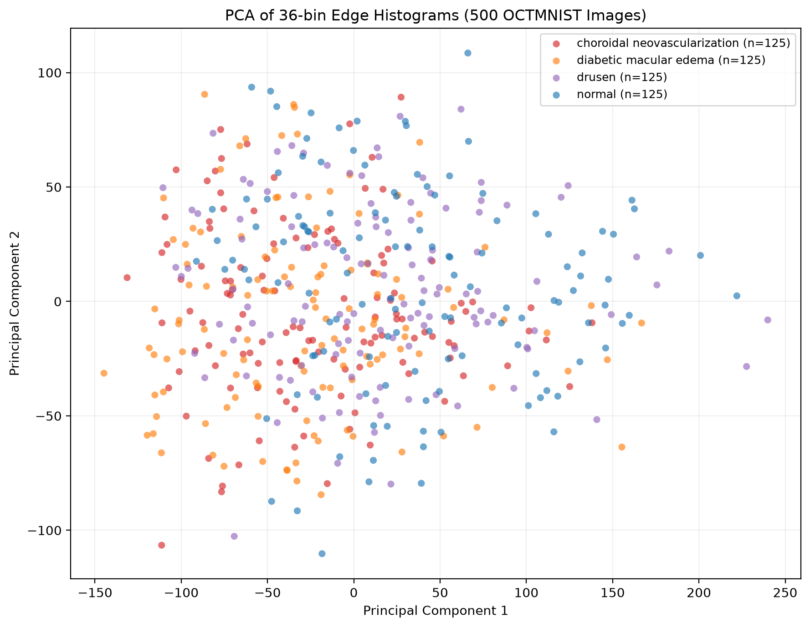

# Image feature extraction and dimensionality reduction results

## Dataset selection

I selected **OCTMNIST**, using all four of its classes: choroidal
neovascularization (CNV), diabetic macular edema (DME), drusen, and normal.
The dataset contains grayscale retinal OCT images, so color-to-grayscale
conversion was not required. I constructed a balanced subset of 500 images,
with 125 images from each class. A fixed random seed of 42 was used so that the
selection is reproducible.

## 2. Edge histograms and similarity measurements

For every image, I used horizontal and vertical Sobel operators to calculate
the edge-gradient angle at each pixel. I then used
`skimage.exposure.histogram` to represent each image with a 36-bin edge-angle
histogram.

One representative image was selected from each class by choosing the image
whose histogram was closest to its class's mean histogram.

I compared the representative CNV and normal histograms. The resulting
distances were:

| Measurement | Distance |
|---|---:|
| Euclidean distance | 66.873014 |
| Manhattan distance | 268.000000 |
| Cosine distance | 0.025762 |

Euclidean and Manhattan distance measure differences in histogram counts,
whereas cosine distance measures the difference in histogram direction or
shape. The relatively small cosine distance indicates that the two histogram
profiles have similar overall shapes even though their individual bin counts
differ.

## 3. HOG descriptor

I computed a HOG descriptor for the representative normal image using 9
orientations, 4 x 4 pixels per cell, and 2 x 2 cells per block. The resulting
feature vector contained 1,296 values.

## 4. PCA dimensionality reduction

I converted all 500 images into 36-dimensional edge-histogram vectors. PCA was
then applied to reduce the data from 36 dimensions to 2 dimensions. The class
labels were not used when fitting PCA; they were used only to assign colors in
the scatter plot.

The first two principal components explain approximately **75.87%** of the
total variance. All four colored point clouds overlap substantially. Therefore,
**zero classes are completely visually separable** in this two-dimensional PCA
plot. This suggests that a global 36-bin edge-orientation histogram alone does
not retain enough spatial information to separate the four OCT diagnoses.

